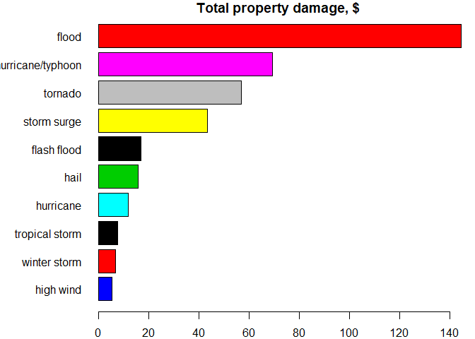
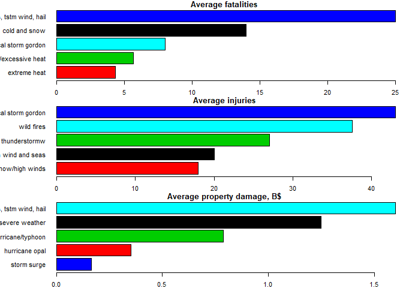

# The Most Deadly and Expensive Storm in USA from 1950-2011. 

## Synopsis
In this analysis, we are trying to answer the following questions, based on weather events in USA from 1950-2011:


1. Across the United States, which types of events are most harmful with respect to population health?
2. Across the United States, which types of events have the greatest economic consequences?


So we conclude that:
According to population health, tornados resulted in the most impact on event fatality, injury (by total number of cases). As for economic consequences, tornado and flooding appeared to have the most impact.

## Introduction

Storms and other severe weather events can cause both public health and economic problems for communities and municipalities. Many severe events can result in fatalities, injuries, and property damage, and preventing such outcomes to the extent possible is a key concern.

This project involves exploring the U.S. National Oceanic and Atmospheric Administration's (NOAA) storm database. This database tracks characteristics of major storms and weather events in the United States, including when and where they occur, as well as estimates of any fatalities, injuries, and property damage.

The basic goal of this research is to explore the NOAA Storm Database and answer some basic questions about severe weather events.


## Data Processing

The data for this research come in the form of a comma-separated-value file compressed via the bzip2 algorithm to reduce its size. You can download the file from web site:


[Storm Data](https://d396qusza40orc.cloudfront.net/repdata%2Fdata%2FStormData.csv.bz2) ~47Mb, 902297 obs., 37 vars.


[Data description](https://d396qusza40orc.cloudfront.net/repdata%2Fpeer2_doc%2Fpd01016005curr.pdf)


The events in the database start in the year 1950 and end in November 2011. In the earlier years of the database there are generally fewer events recorded, most likely due to a lack of good records. More recent years should be considered more complete.


So, we just load the data and extract an appropriate vars:


- EVTYPE - types of event (e.g. tornado)
- FATALITIES - fatalities count
- INJURIES - injuries count
- PROPDMG - estimation of property damage
- PROPDMGEXP - multiplier of property damage


```r
data<-read.csv("repdata_data_StormData.csv.bz2")
data<-data[,c(8,23,24,25,26)] #extract EVTYPE, FATALITIES, INJURIES, PROPDMG, PROPDMGEXP
data$EVTYPE<-toupper(data$EVTYPE) #uppercase correction

library(plyr)
data$PROPDMGEXP<- mapvalues(data$PROPDMGEXP, from = c("K", "M","", "B", "m", "+", "0", "5", "6", "?", "4", "2", "3", "h", "7", "H", "-", "1", "8"), to = c(10^3, 10^6, 1, 10^9, 10^6, 0,1,10^5, 10^6, 0, 10^4, 10^2, 10^3, 10^2, 10^7, 10^2, 0, 10, 10^8)) #change their strange symbols
data$PROPDMGEXP <- as.numeric(as.character(data$PROPDMGEXP)) #make it numeric 
data$PROPDMGTotal <- (data$PROPDMG * data$PROPDMGEXP)/1e+09 #multiply the two columns and make a new column "Billions $USD"

summary(data)
```

```
##     EVTYPE            FATALITIES          INJURIES            PROPDMG       
##  Length:902297      Min.   :  0.0000   Min.   :   0.0000   Min.   :   0.00  
##  Class :character   1st Qu.:  0.0000   1st Qu.:   0.0000   1st Qu.:   0.00  
##  Mode  :character   Median :  0.0000   Median :   0.0000   Median :   0.00  
##                     Mean   :  0.0168   Mean   :   0.1557   Mean   :  12.06  
##                     3rd Qu.:  0.0000   3rd Qu.:   0.0000   3rd Qu.:   0.50  
##                     Max.   :583.0000   Max.   :1700.0000   Max.   :5000.00  
##    PROPDMGEXP         PROPDMGTotal     
##  Min.   :0.000e+00   Min.   :0.00e+00  
##  1st Qu.:1.000e+00   1st Qu.:0.00e+00  
##  Median :1.000e+00   Median :0.00e+00  
##  Mean   :5.754e+04   Mean   :4.70e-04  
##  3rd Qu.:1.000e+03   3rd Qu.:0.00e+00  
##  Max.   :1.000e+09   Max.   :1.15e+02
```
Note: Property Damage has two columns where one is a multiplier (represented by a symbol like k, m, B) and the other column is the coefficient. It is therefore necessary to create another column which puts the multiplier and coefficient columns together.


## Results


According to the first question, let's see how total fatalities and injuries distributed by event type. 


Top-10 are:

```r
f<-aggregate(FATALITIES ~ EVTYPE, data, sum)
i<-aggregate(INJURIES ~ EVTYPE, data, sum)

f<-f[f$FATALITIES > 0,]   #zero-values ex.
i<-i[i$INJURIES > 0,]

f<-f[order(-f$FATALITIES),] #sort
i<-i[order(-i$INJURIES),]

head(f, n = 10)
```

```
##             EVTYPE FATALITIES
## 758        TORNADO       5633
## 116 EXCESSIVE HEAT       1903
## 138    FLASH FLOOD        978
## 243           HEAT        937
## 418      LIGHTNING        816
## 779      TSTM WIND        504
## 154          FLOOD        470
## 524    RIP CURRENT        368
## 320      HIGH WIND        248
## 19       AVALANCHE        224
```

```r
head(i, n = 10)
```

```
##                EVTYPE INJURIES
## 758           TORNADO    91346
## 779         TSTM WIND     6957
## 154             FLOOD     6789
## 116    EXCESSIVE HEAT     6525
## 418         LIGHTNING     5230
## 243              HEAT     2100
## 387         ICE STORM     1975
## 138       FLASH FLOOD     1777
## 685 THUNDERSTORM WIND     1488
## 212              HAIL     1361
```


Let's see this on plot. There are the impact of top-10 weather events in USA from 1950-2011.


```r
f10<-head(f, n = 10)
i10<-head(i, n = 10)

f10<-f10[order(f10$FATALITIES),] #sort
i10<-i10[order(i10$INJURIES),]

par(mfcol=c(1,2), mar=c(2,7,1,1))

barplot(height=f10$FATALITIES, names=tolower(f10$EVTYPE), col=factor(f10$EVTYPE), horiz=T, las=1, main = "Total fatalities")

barplot(height=i10$INJURIES, names=tolower(i10$EVTYPE), col=factor(i10$EVTYPE), horiz=T, las=1, main = "Total injuries")
```

<!-- -->


According to the second question, let's see how total damage (billions $) distributed by event type. 
Top-10 are:

```r
p<-aggregate(PROPDMGTotal ~ EVTYPE, data, sum)

p<-p[p$PROPDMGTotal > 0,]   #zero-values ex.

p<-p[order(-p$PROPDMGTotal),] #sort

head(p, n = 10)
```

```
##                EVTYPE PROPDMGTotal
## 154             FLOOD   144.657710
## 372 HURRICANE/TYPHOON    69.305840
## 758           TORNADO    56.947381
## 599       STORM SURGE    43.323536
## 138       FLASH FLOOD    16.822674
## 212              HAIL    15.735268
## 363         HURRICANE    11.868319
## 772    TROPICAL STORM     7.703891
## 888      WINTER STORM     6.688497
## 320         HIGH WIND     5.270046
```

Let's see this on plot:


```r
p10<-head(p, n = 10)

p10<-p10[order(p10$PROPDMGTotal),] #sort

par(mar=c(2,7,1,1))

barplot(height=p10$PROPDMGTotal, names=tolower(p10$EVTYPE), col=factor(p10$EVTYPE), horiz=T, las=1, main = "Total property damage, $")
```

<!-- -->

Now, let's see on top-5 average values. There are the impact of top-5 weather events in USA from 1950-2011.


```r
f<-aggregate(FATALITIES ~ EVTYPE, data, mean)
i<-aggregate(INJURIES ~ EVTYPE, data, mean)
p<-aggregate(PROPDMGTotal ~ EVTYPE, data, mean)

p<-p[order(-p$PROPDMGTotal),] #sort
f<-f[order(-f$FATALITIES),] 
i<-i[order(-i$INJURIES),]

p5<-head(p, n = 5)
f5<-head(f, n = 5)
i5<-head(i, n = 5)

f5
```

```
##                         EVTYPE FATALITIES
## 766 TORNADOES, TSTM WIND, HAIL  25.000000
## 62               COLD AND SNOW  14.000000
## 775      TROPICAL STORM GORDON   8.000000
## 519      RECORD/EXCESSIVE HEAT   5.666667
## 127               EXTREME HEAT   4.363636
```

```r
i5
```

```
##                    EVTYPE INJURIES
## 775 TROPICAL STORM GORDON     43.0
## 872            WILD FIRES     37.5
## 746         THUNDERSTORMW     27.0
## 327    HIGH WIND AND SEAS     20.0
## 585       SNOW/HIGH WINDS     18.0
```

```r
p5
```

```
##                         EVTYPE PROPDMGTotal
## 766 TORNADOES, TSTM WIND, HAIL    1.6000000
## 262  HEAVY RAIN/SEVERE WEATHER    1.2500000
## 372          HURRICANE/TYPHOON    0.7875664
## 370             HURRICANE OPAL    0.3525384
## 599                STORM SURGE    0.1659906
```

```r
p5<-p5[order(p5$PROPDMGTotal),] #sort
f5<-f5[order(f5$FATALITIES),] 
i5<-i5[order(i5$INJURIES),]

par(mfcol=c(3,1), mar=c(2,7,1,1))

barplot(height=f5$FATALITIES, names=tolower(f5$EVTYPE), col=factor(f5$EVTYPE), horiz=T, las=1, main = "Average fatalities")

barplot(height=i5$INJURIES, names=tolower(i5$EVTYPE), col=factor(i5$EVTYPE), horiz=T, las=1, main = "Average injuries")

barplot(height=p5$PROPDMGTotal, names=tolower(p5$EVTYPE), col=factor(p5$EVTYPE), horiz=T, las=1, main = "Average property damage, B$")
```

<!-- -->

## Discussion


On average tornado, cold and snow, and wild fires are the most influence types with respect to population health. But the most expensive types are some kinds of flood and tornado.
This context may be very different by States.


You may access that puplication on my [RPubs](https://rpubs.com/Ellariel/noaa)


.
